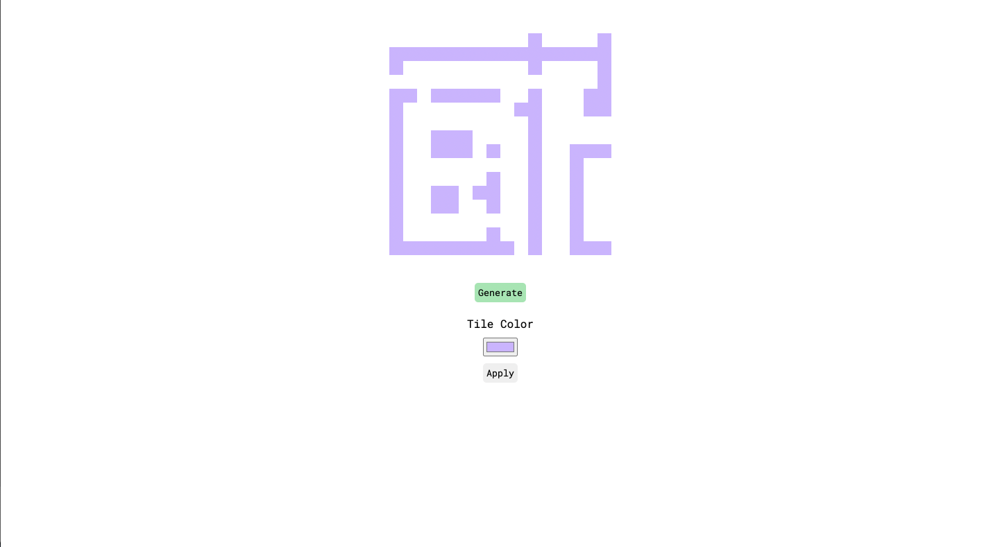

# JS Cave Generator

## [Deployment Link](http://op-js-cave-generator.surge.sh/)

**Known Bugs**
 
*none

### About
I used to play with cave generation back a few years ago when I developed games as a hobby. I decided to revive my love for RNG and algorithm by creating a 2D 'platformer style cave', using a basic level of [Cellular Automaton](https://mathworld.wolfram.com/CellularAutomaton.html). Would be cool to code a little man to jump around this sometime.

### Screenshots

'Cave Generation'

### Technologies Used
* HTML
* CSS
* JavaScript

### Favorites
Besides implementing auth scratch, I am extremely proud of the Route Finder, and the handler I built to manage and divide our the search results from the Route Finder into separate pages.

### Growth
Due to my skill with this Cellular Automaton previously being fine tuned, I found it slighly challenging to get to grips with the basics again. The algorithmic logic helped refine my JS ability by ultimately solving a more complex problem.

#### Icebox
(In no partucular order)
* Allow users to play with variables and experience a basic level of Cellular Automaton manipulation for themselves.
* More efficient filter algorithm ? (this one is horribly innefficient. O(n * n * n), time complexity becomes an issue the larger of a grid you generate)
